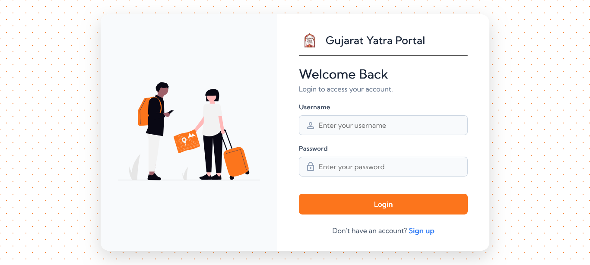

# 🌐 Gujarat Yatra Portal – Plan, Explore, Experience  

### 🧑‍💻 Developed by: **Drashti Karabhai Bhatiya**  
📧 Email: [bhatiadrashti27@gmail.com](mailto:bhatiadrashti27@gmail.com)  
🏫 SMT. C.Z.M. Gosrani B.C.A. College, Jamnagar  
📚 Academic Year: 2025–26 | T.Y. B.C.A. Sem-5  

---

## 📝 Project Overview  

**Gujarat Yatra Portal** is a PHP-based **Travel Information and Booking System** designed to simplify travel planning across Gujarat.  
It allows users to explore destinations, view attractions, read reviews, and make bookings — all through one integrated platform.  

---

## 🚀 Features  

### 👤 User Module  
- Register and Login  
- Explore Gujarat cities, attractions, and travel packages  
- Submit reviews and ratings  
- Book packages and view booking history  

### 🧑‍💼 Admin Module  
- Manage cities, attractions, packages, and transport details  
- Manage bookings and approve/delete reviews  
- Maintain database integrity  

### 🌍 Guest Module  
- Browse destinations and attractions without login  
- View packages and transport options  

---

## 🧩 Folder Structure  

```

Gujarat-Yatra-Portal/
│
├── admin/                      → Admin dashboard & management pages
│
├── assets/
│   ├── css/                    → Stylesheets
│   ├── fonts/                  → Font files
│   ├── icons/                  → Icon files
│   ├── img/                    → All images and screenshots (note: folder name is `img`)
│   ├── js/                     → JavaScript files
│   └── svg/                    → SVG assets
│
├── includes/
│   ├── authenticate.php        → Authentication/session checks
│   ├── db_connect.php          → Database connection (used across pages)
│   ├── footer.php              → Shared site footer
│   ├── header.php              → Shared site header / nav
│   └── process_register.php    → Registration handling script
│
├── pages/
│   ├── about.php → About Gujarat Yatra Portal
│   ├── attractions.php → Displays all tourist attractions
│   ├── booking.php → Handles package booking process
│   ├── cities.php → Shows Gujarat cities
│   ├── city-detail.php → Displays details for a specific city
│   ├── my_bookings.php → Shows user’s booking history
│   ├── package-detail.php → Displays detailed package information
│   ├── packages.php → Lists all travel packages
│   ├── reviews.php → Shows reviews and ratings
│   └── search.php → Provides search functionality
│
├── user/
│   ├── login.php               → User login page / handler
│   ├── logout.php              → Logout script
│   └── register.php            → User registration page
│
├── index.php                   → Homepage entry
├── LICENSE                     → License file (All Rights Reserved)
├── README.md                   → Project README (this file)
└── traveldb.sql                → SQL dump to create/import the database


````

---

## 🛠️ Tech Stack  

| Category | Technologies |
|-----------|---------------|
| **Frontend** | HTML, CSS, JavaScript |
| **Backend** | PHP (v8.4) |
| **Database** | MySQL (v8.4.5) |
| **Tools** | XAMPP, phpMyAdmin, VS Code |

---

## 💡 Core Modules  

### 1. User Authentication  
- Secure login and registration using PHP sessions  
- Passwords stored via `password_hash()`  

### 2. Content Browsing  
- Dynamic pages for Cities, Attractions, and Packages  
- Search functionality with filters  

### 3. Booking System  
- Booking form for travel packages  
- Stores booking details with total cost and travel date  

### 4. Admin Dashboard  
- CRUD operations for packages, cities, and reviews  
- Booking management with approval control  

### 5. Review System  
- Registered users can post reviews  
- Admin moderates and manages them  

---

## ⚙️ Installation & Setup  

1. **Clone the repository**
   ```bash
   git clone https://github.com/yourusername/Gujarat-Yatra-Portal.git

2. **Move project folder**
   Place it inside the `htdocs` directory of XAMPP.

3. **Database Setup**

   * Open [phpMyAdmin](http://localhost/phpmyadmin)
   * Create a new database named `gujaratyatra`
   * Import the file `gujaratyatra.sql` located in the `sql/` folder

4. **Run the project**

   * Start Apache and MySQL from XAMPP Control Panel
   * Open [http://localhost/Gujarat-Yatra-Portal](http://localhost/Gujarat-Yatra-Portal) in your browser

---

## 📷 Screenshots

| Page                           | Description                                        |
| ------------------------------ | -------------------------------------------------- |
| 🏠 **Home Page**               | Displays featured destinations and navigation menu |
| 🔐 **Login & Signup**          | User authentication screens                        |
| 🏞️ **Attractions & Packages** | Lists all cities, attractions, and package details |
| 🧾 **Booking Page**            | Allows users to book travel packages               |
| 📋 **Admin Dashboard**         | Admin management panel                             |
| 💬 **Reviews Page**            | Displays and manages user reviews                  |

*(You can upload screenshots in the `/images` folder and update links here.)*

---

## 📷 Screenshots  

### 🏠 Home Page  


### 🔐 Login Page  


### 🧾Attractions.png Page  

* Improve UI design with a modern framework

---

## 🧾 References

* [Gujarat Tourism Official Site](https://www.gujarattourism.com)
* [Incredible India Tourism](https://www.incredibleindia.org)
* **Books:**

  * *PHP & MySQL Web Development* – Luke Welling & Laura Thomson
  * *Learning PHP, MySQL & JavaScript* – Robin Nixon

---

## 📜 License

© 2025 **Drashti Bhatiya**
All Rights Reserved.
You may view this project for educational purposes only.
Reproduction, modification, or redistribution is prohibited without permission.

---

## 💬 Contact

For queries or opportunities, reach out at:
📧 **[bhatiadrashti27@gmail.com](mailto:bhatiadrashti27@gmail.com)**


